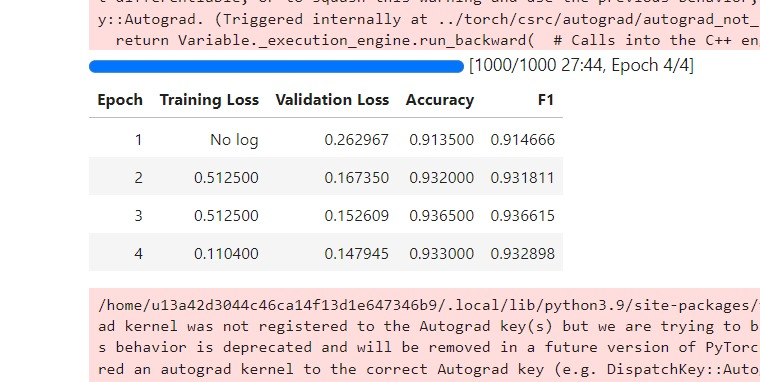
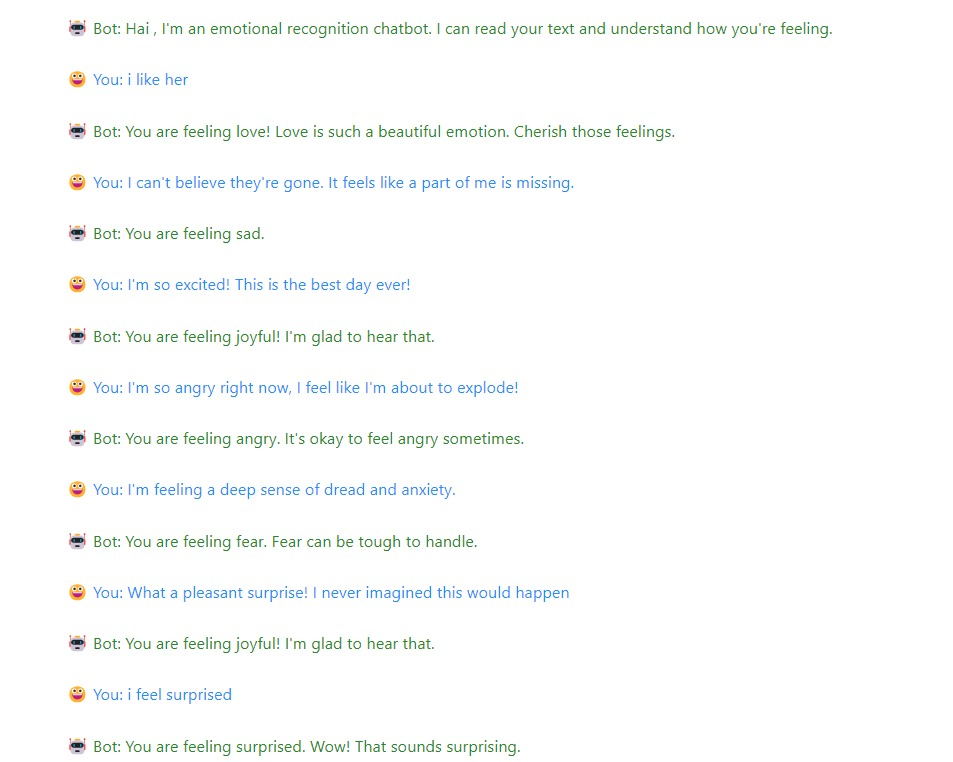
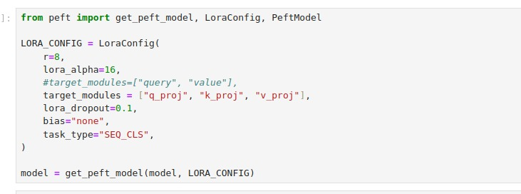
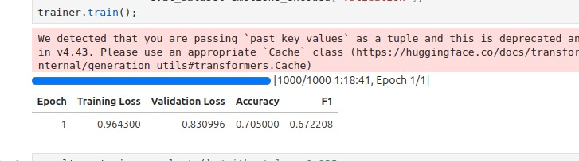

<h3>Fine tuning Bert-base-uncased on emotion dataset</h3>

<h3>Chatbot inference showing all six classifications</h3>

<h3>LORA Fine tuning parameters for llama-3b-v2</h3>

---------------------------------------------------------------
 
result at 1 epoch(server constraints limits us to 1 epoch)
